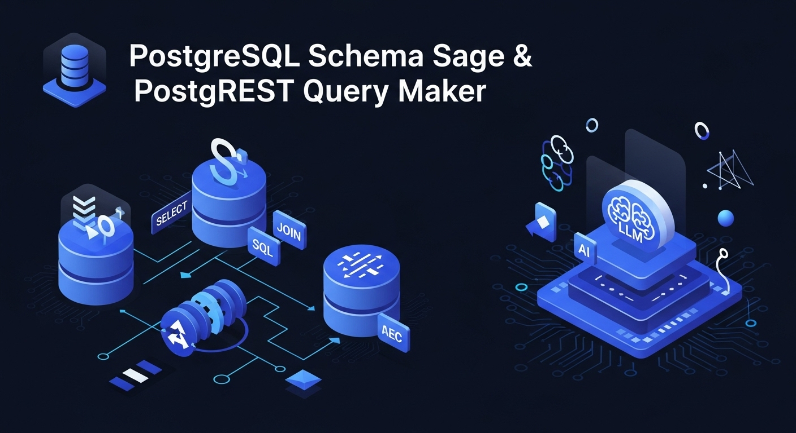

# 🐘 PostgreSQL Schema Sage & PostgREST Query Maker



[](https://opensource.org/licenses/MIT)
[](https://www.typescriptlang.org/)
[](https://www.postgresql.org/)
[](https://postgrest.org/)
[](CONTRIBUTING.md)

> **An intelligent TypeScript MCP (Model Context Protocol) server that combines the wisdom of database schema analysis with the power of natural language PostgREST query generation. Your AI-powered companion for PostgreSQL database management and API development.**

## 🌟 Overview

**PostgreSQL Schema Sage & PostgREST Query Maker** is a comprehensive, open-source MCP server that revolutionizes how developers interact with PostgreSQL databases and PostgREST APIs. Whether you're managing database migrations, analyzing schema drift, or generating complex API queries from natural language, this tool serves as your intelligent database companion.

### 🎯 What Makes It Special?

- **🧙‍♂️ Schema Sage**: Deep database introspection with AI-powered analysis using Google Gemini
- **🚀 Query Maker**: Natural language to PostgREST query conversion with intelligent join detection
- **🔒 Safety First**: Built-in read-only modes and query safety validation
- **🔄 Migration Master**: Complete dbmate integration with schema drift detection
- **🤖 AI Enhanced**: Gemini-powered schema analysis and query optimization
- **🔗 Join Intelligence**: Automatic relationship detection and embedded resource generation

## ✨ Key Features

### 🗄️ Advanced Database Management
- **Complete PostgreSQL Schema Introspection**: Extract and analyze tables, columns, indexes, constraints, enums, functions, extensions, views, triggers, and RLS policies
- **Intelligent Schema Analysis**: AI-powered schema summarization and optimization recommendations
- **Schema Drift Detection**: Compare current database state with applied migrations
- **dbmate Integration**: Full support for dbmate migration workflows with advanced templates

### 🌐 Intelligent PostgREST Integration
- **Natural Language Query Generation**: Convert plain English to PostgREST API calls
- **Smart Join Detection**: Automatically identify and generate relationship-aware queries
- **Read-Only Safety Mode**: Enforce safe query practices with comprehensive validation
- **Keycloak Authentication**: Secure API access with enterprise-grade authentication
- **Query Safety Analysis**: Three-tier safety assessment (SAFE/CAUTION/UNSAFE)

### 🔗 Advanced Join Capabilities
- **Relationship Intelligence**: Automatically detect foreign key relationships
- **Embedded Resource Generation**: Create complex nested queries with `select=*,orders(*),profiles(*)`
- **Natural Language Patterns**: Understand phrases like "users with their orders" or "customers and their purchases"
- **Confidence Scoring**: Relationship detection with confidence levels and explanations

### 🛡️ Enterprise-Grade Safety
- **Query Validation**: Prevent dangerous operations with smart safety checks
- **Operation Filtering**: Configurable whitelist/blacklist for allowed operations
- **Performance Monitoring**: Query complexity analysis and optimization suggestions
- **Security Best Practices**: Built-in protection against common query pitfalls

## 🚀 Quick Start

### Prerequisites
- Node.js 18+
- PostgreSQL 12+
- TypeScript 4.9+
- (Optional) PostgREST instance
- (Optional) Keycloak for authentication

### Installation

```bash
# Clone the repository
git clone https://github.com/your-org/postgresql-schema-sage.git
cd postgresql-schema-sage

# Install dependencies
npm install

# Build the project
npm run build

# Start the server
npm start
```

### Basic Configuration

```bash
# Database connection
DB_HOST=localhost
DB_PORT=5432
DB_NAME=your_database
DB_USER=your_username
DB_PASSWORD=your_password

# Optional: PostgREST integration
POSTGREST_ENDPOINT=http://localhost:3000
KEYCLOAK_URL=http://localhost:8080
KEYCLOAK_CLIENT_ID=your_client_id
KEYCLOAK_USERNAME=your_username
KEYCLOAK_PASSWORD=your_password

# Optional: AI Enhancement
GEMINI_API_KEY=your_gemini_api_key
```

## 🛠️ Developer Guidelines

### 🏗️ Architecture Overview

The project follows a clean, modular architecture:

```
src/
├── index.ts                           # 🎯 MCP Server Entry Point
├── types/                             # 📋 TypeScript Definitions
│   ├── schema.ts                      # Database schema types
│   ├── migration.ts                   # Migration-related types
│   ├── postgrest.ts                   # PostgREST API types
│   └── config.ts                      # Configuration types
├── services/                          # 🔧 Core Business Logic
│   ├── database.ts                    # PostgreSQL introspection
│   ├── migration-parser.ts            # dbmate migration analysis
│   ├── schema-analyzer.ts             # Schema drift detection
│   ├── gemini-service.ts              # AI-powered analysis
│   ├── postgrest-client.ts            # PostgREST API client
│   ├── postgrest-query-generator.ts   # Natural language processing
│   └── keycloak-auth.ts               # Enterprise authentication
├── tools/                             # 🔨 MCP Tool Implementations
│   ├── analyze-schema.ts              # Schema analysis tool
│   ├── postgrest-generate-query.ts    # Query generation tool
│   └── ...                           # Additional tools
├── utils/                             # 🧰 Shared Utilities
│   ├── schema-filter.ts               # Schema optimization
│   ├── dbmate-utils.ts                # Migration utilities
│   └── logger.ts                      # Structured logging
└── templates/                         # 📝 Migration Templates
    └── migration-templates.ts         # Pre-built migration patterns
```

### 🎨 Code Style & Standards

- **TypeScript First**: Leverage strong typing for reliability
- **Error Handling**: Comprehensive error handling with structured logging
- **Performance**: Optimized single-query schema fetching
- **Security**: Input validation with Zod schemas
- **Modularity**: Clean separation of concerns
- **Testing**: Write tests for critical functionality

### 🔧 Development Commands

```bash
# Development with hot reload
npm run dev

# Build TypeScript
npm run build

# Clean build artifacts
npm run clean

# Run tests (when available)
npm test

# Lint code
npm run lint

# Type checking
npm run typecheck
```

### 📊 Performance Considerations

- **Single Query Optimization**: Database schema fetched in one comprehensive CTE-based query
- **Schema Caching**: Intelligent caching to reduce database load
- **Memory Management**: Streaming large results as JSON
- **Connection Pooling**: Efficient database connection management

## 🤝 Contributing

We welcome contributions from the community! This project is open source and thrives on collaborative development.

### 🌟 How to Contribute

1. **🍴 Fork the Repository**
   ```bash
   git fork https://github.com/your-org/postgresql-schema-sage.git
   ```

2. **🌿 Create a Feature Branch**
   ```bash
   git checkout -b feature/amazing-new-feature
   ```

3. **✨ Make Your Changes**
   - Follow our coding standards
   - Add tests for new functionality
   - Update documentation as needed

4. **🧪 Test Your Changes**
   ```bash
   npm run build
   npm run test
   ```

5. **📝 Commit Your Changes**
   ```bash
   git commit -m "feat: add amazing new feature"
   ```

6. **🚀 Push to Your Fork**
   ```bash
   git push origin feature/amazing-new-feature
   ```

7. **🎉 Create a Pull Request**
   - Provide a clear description of changes
   - Reference any related issues
   - Include screenshots if applicable

### 🎯 Areas for Contribution

We especially welcome contributions in these areas:

#### 🔥 High Priority
- **Query Pattern Recognition**: Expand natural language processing patterns
- **Database Support**: Add support for other databases (MySQL, SQLite)
- **Performance Optimization**: Improve query generation speed
- **Test Coverage**: Add comprehensive test suites

#### 🌈 Feature Enhancements
- **Advanced Join Logic**: Support for complex join scenarios
- **Query Caching**: Implement intelligent query result caching
- **Migration Rollback**: Enhanced rollback safety analysis
- **API Documentation**: Auto-generate API documentation

#### 🛠️ Developer Experience
- **CLI Tools**: Create command-line utilities
- **VS Code Extension**: IDE integration for better developer experience
- **Docker Support**: Containerization for easy deployment
- **Kubernetes Helm Charts**: Cloud-native deployment options

#### 📚 Documentation & Examples
- **Tutorial Content**: Step-by-step guides and tutorials
- **Video Demonstrations**: Screen recordings of key features
- **Best Practices**: Database design and API development guides
- **Real-world Examples**: Integration examples with popular frameworks

### 🏷️ Contribution Guidelines

#### 📋 Code Standards
- Use TypeScript with strict mode enabled
- Follow existing naming conventions
- Add JSDoc comments for public APIs
- Ensure all tests pass before submitting
- Follow semantic commit message format

#### 🧪 Testing Requirements
- Write unit tests for new services
- Add integration tests for database operations
- Test error handling scenarios
- Verify TypeScript compilation

#### 📖 Documentation Standards
- Update README for new features
- Add inline code documentation
- Include examples in pull requests
- Update CHANGELOG.md

### 🏆 Recognition

Contributors will be recognized in:
- **Contributors section** in README
- **Release notes** for significant contributions
- **Special mentions** in project announcements

## 📚 Comprehensive Tool Reference

### 🔍 Schema Analysis Tools

#### `analyze_schema`
Advanced PostgreSQL schema introspection with AI enhancement.

**Parameters:**
```typescript
{
  includeSystemSchemas?: boolean;     // Include system schemas
  tableFilter?: string;               // Filter tables by pattern
  schemaFilter?: string;              // Filter by schema name
  useGeminiAnalysis?: boolean;        // Enable AI analysis
  analysisIntent?: 'query_generation' | 'migration_analysis' | 'overview';
  maxTableSize?: number;              // Limit analysis scope
}
```

**Example:**
```json
{
  "tableFilter": "user",
  "useGeminiAnalysis": true,
  "analysisIntent": "query_generation",
  "maxTableSize": 50
}
```

### 🔄 Migration Management Tools

#### `generate_migration`
Create dbmate-compatible migrations with safety analysis.

**Parameters:**
```typescript
{
  name: string;                       // Migration name
  upSql: string;                      // Forward migration SQL
  downSql: string;                    // Rollback migration SQL
  saveToFile?: boolean;               // Save to filesystem
  riskAssessment?: boolean;           // Analyze migration risk
}
```

#### `compare_schema_migrations`
Detect schema drift with detailed analysis.

**Parameters:**
```typescript
{
  migrationsTable?: string;           // Migrations table name
  includeDetails?: boolean;           // Detailed comparison
  checkViews?: boolean;               // Include view analysis
  checkTriggers?: boolean;            // Include trigger analysis
  checkRLS?: boolean;                 // Include RLS policy analysis
}
```

### 🌐 PostgREST Query Tools

#### `postgrest_generate_query`
Convert natural language to PostgREST queries with intelligence.

**Parameters:**
```typescript
{
  description: string;                // Natural language description
  tables?: string[];                  // Focus tables
  readOnlyMode?: boolean;             // Enforce read-only queries
  includeRelationships?: boolean;     // Auto-detect joins
  maxRows?: number;                   // Result limit
  safetyLevel?: 'strict' | 'moderate' | 'permissive';
}
```

**Examples:**
```json
{
  "description": "Get users with their orders and shipping addresses",
  "readOnlyMode": true,
  "includeRelationships": true,
  "maxRows": 100
}
```

#### `postgrest_execute_query`
Execute PostgREST queries with safety validation.

**Parameters:**
```typescript
{
  query: PostgRESTQuery;              // Query object
  dryRun?: boolean;                   // Preview only
  readOnlyMode?: boolean;             // Safety mode
  bypassSafetyChecks?: boolean;       // Override safety (use with caution)
}
```

## 🔗 Natural Language Query Examples

### Basic Queries
```
"Get all active users"
→ GET /users?active=eq.true

"Find users created in the last week"
→ GET /users?created_at=gte.2024-01-15

"Show me the first 10 products sorted by price"
→ GET /products?order=price.asc&limit=10
```

### Relationship Queries
```
"Get users with their orders"
→ GET /users?select=*,orders(*)

"Show customers and their recent purchases"
→ GET /customers?select=*,orders(*),orders.order_items(*)

"Find all posts with author information and comments"
→ GET /posts?select=*,authors(*),comments(*)
```

### Complex Filtering
```
"Get expensive products in electronics category"
→ GET /products?price=gte.100&category=eq.electronics

"Find users who haven't logged in for 30 days"
→ GET /users?last_login=lt.2024-01-01

"Show active orders with pending status"
→ GET /orders?status=eq.pending&active=eq.true
```

## 🏗️ Project Structure Deep Dive

### 🎯 Core Services

#### Database Service (`services/database.ts`)
- **Single Query Optimization**: Fetches complete schema in one CTE-based query
- **Connection Management**: Proper connection pooling and cleanup
- **Security**: Parameterized queries and SQL injection prevention

#### Query Generator (`services/postgrest-query-generator.ts`)
- **Pattern Recognition**: Advanced regex patterns for natural language
- **Relationship Analysis**: Confidence-based relationship detection
- **Safety Validation**: Multi-tier safety assessment

#### Schema Analyzer (`services/schema-analyzer.ts`)
- **Drift Detection**: Compare live schema vs migration history
- **Change Analysis**: Granular change detection and reporting
- **Risk Assessment**: Evaluate potential migration impacts

### 🔧 Utility Classes

#### Schema Filter (`utils/schema-filter.ts`)
- **Intelligent Filtering**: Business table detection
- **Size Optimization**: Compress large schemas for AI analysis
- **Intent-Based Filtering**: Context-aware schema reduction

#### Logger (`utils/logger.ts`)
- **Structured Logging**: JSON-formatted logs with context
- **Performance Tracking**: Built-in timing and metrics
- **Error Handling**: Comprehensive error logging and tracking

## 🔒 Security & Safety Features

### Query Safety Levels
- **🟢 SAFE**: Read-only queries with proper filtering
- **🟡 CAUTION**: Potentially expensive or complex operations
- **🔴 UNSAFE**: Dangerous operations requiring explicit approval

### Built-in Protections
- **SQL Injection Prevention**: Parameterized queries only
- **Read-Only Mode**: Configurable operation restrictions
- **Input Validation**: Zod schema validation for all inputs
- **Rate Limiting**: Built-in query complexity analysis

## 🌐 Integration Examples

### With Claude Desktop
```json
{
  "mcpServers": {
    "postgresql-schema-sage": {
      "command": "node",
      "args": ["./build/index.js"],
      "env": {
        "DB_NAME": "your_database",
        "DB_USER": "your_user",
        "DB_PASSWORD": "your_password"
      }
    }
  }
}
```

### With PostgREST
```bash
# Start PostgREST
postgrest postgrest.conf

# Configure the MCP server
POSTGREST_ENDPOINT=http://localhost:3000
```

### With Docker
```dockerfile
FROM node:18-alpine
WORKDIR /app
COPY package*.json ./
RUN npm ci --only=production
COPY build/ ./build/
CMD ["node", "build/index.js"]
```

## 📈 Performance Metrics

### Schema Analysis Performance
- **Large Databases**: Handles 1000+ tables efficiently
- **Memory Usage**: Optimized for large schema processing
- **Query Time**: Single-query schema fetch in <2 seconds
- **AI Analysis**: Gemini-powered insights in <5 seconds

### Query Generation Speed
- **Simple Queries**: Generated in <100ms
- **Complex Joins**: Generated in <500ms
- **Relationship Detection**: Sub-second analysis
- **Safety Validation**: Immediate feedback

## 🔮 Roadmap

### Short Term (Next 3 Months)
- [ ] Enhanced test coverage (>90%)
- [ ] MySQL and SQLite support
- [ ] Advanced query caching
- [ ] Performance optimization

### Medium Term (6 Months)
- [ ] GraphQL query generation
- [ ] Advanced migration rollback analysis
- [ ] Real-time schema change detection
- [ ] Web-based dashboard

### Long Term (1 Year)
- [ ] Multi-database federation
- [ ] Advanced AI query optimization
- [ ] Enterprise deployment tools
- [ ] Cloud-native features

## 📄 License

MIT License - see [LICENSE](LICENSE) file for details.

## 🙏 Acknowledgments

- **PostgREST Community**: For the amazing PostgreSQL REST API framework
- **dbmate**: For the excellent migration tool
- **MCP Protocol**: For enabling AI-native tool integration
- **PostgreSQL Team**: For the world's most advanced open source database
- **Google Gemini**: For AI-powered database analysis capabilities

## 📞 Community & Support

- **GitHub Issues**: [Report bugs and request features](https://github.com/your-org/postgresql-schema-sage/issues)
- **Discussions**: [Join community discussions](https://github.com/your-org/postgresql-schema-sage/discussions)
- **Discord**: [Join our community chat](#) 
- **Documentation**: [Comprehensive guides and tutorials](#)

---

**🌟 Star this repository if you find it useful! Every star helps us grow the community and improve the project.**

**🤝 Contributing is welcome! Check out our [Contributing Guidelines](CONTRIBUTING.md) to get started.**

**💬 Questions? Join our community discussions or open an issue. We're here to help!**