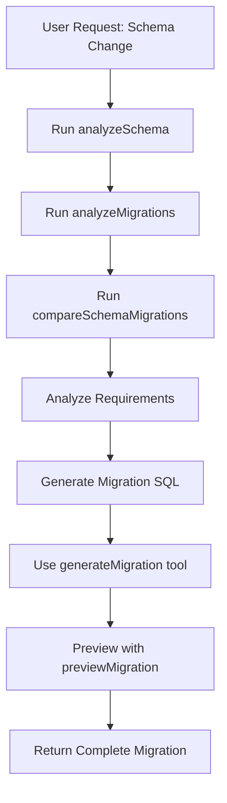
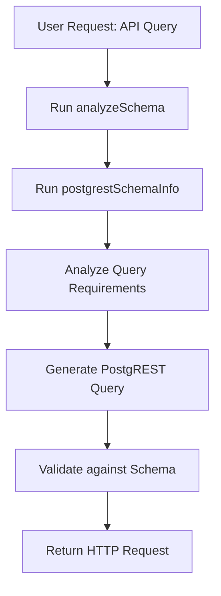

# MCP PostgreSQL Migration Server Integration Guide

This guide explains how to integrate and use the PostgreSQL Migration Server system prompts with the MCP tools for automated migration generation and PostgREST query creation.

## Overview

The MCP server provides two main system prompts that leverage real-time database schema analysis:

1. **Migration Generator** (`migration-generator-prompt.md`) - For creating database migrations
2. **PostgREST Query Generator** (`postgrest-query-generator-prompt.md`) - For generating API queries

## Available MCP Tools

### Schema Analysis Tools
- `analyzeSchema` - Complete database schema analysis (tables, views, RLS, functions)
- `analyzeMigrations` - Migration history and pattern analysis  
- `compareSchemaMigrations` - Schema drift detection between current state and migrations

### Migration Tools
- `generateMigration` - Create new migration files
- `previewMigration` - Preview migration effects without applying

### PostgREST Tools
- `postgrestGenerateQuery` - Generate PostgREST API queries from natural language
- `postgrestExecuteQuery` - Execute queries against PostgREST endpoint
- `postgrestSchemaInfo` - Get PostgREST schema information
- `postgrestTestConnection` - Test PostgREST connectivity

## Integration Workflow

### 1. Migration Generation Workflow



#### Example Implementation:
```
User: "Add a user_preferences table with foreign key to users"

Step 1: analyzeSchema()
- Get current schema state
- Check if 'users' table exists
- Understand existing RLS patterns

Step 2: analyzeMigrations() 
- Understand naming conventions
- Check migration patterns
- Identify common practices

Step 3: compareSchemaMigrations()
- Detect any schema drift
- Ensure clean state for new migration

Step 4: Generate Migration
- Create table with proper structure
- Add foreign key constraints
- Include RLS policies if pattern exists
- Generate proper down migration

Step 5: Use generateMigration tool
- Save migration to file system
- Follow dbmate naming conventions
```

### 2. PostgREST Query Generation Workflow



#### Example Implementation:
```
User: "Get all active users with their recent posts"

Step 1: analyzeSchema()
- Verify users and posts tables exist
- Check column structures and types
- Identify foreign key relationships
- Check RLS policies

Step 2: postgrestSchemaInfo()
- Get available endpoints
- Understand PostgREST configuration
- Check authentication requirements

Step 3: Generate Query
- Create GET request with proper relationships
- Add filtering for active users
- Include posts with date filtering
- Respect RLS policy constraints
```

## System Prompt Usage Examples

### Migration Generation Example

**User Request:** "Add email verification to users table"

**System Response using Migration Prompt:**

1. **Schema Analysis:**
```
Running analyzeSchema()...
Found users table with columns: id, name, email, created_at, updated_at
RLS enabled with policies for user access
No email verification columns exist
```

2. **Migration Generation:**
```sql
-- migrate:up
ALTER TABLE users ADD COLUMN email_verified BOOLEAN DEFAULT FALSE NOT NULL;
ALTER TABLE users ADD COLUMN email_verification_token VARCHAR(255);
ALTER TABLE users ADD COLUMN email_verification_expires_at TIMESTAMP;

CREATE INDEX CONCURRENTLY idx_users_email_verification_token 
ON users (email_verification_token) 
WHERE email_verification_token IS NOT NULL;

-- Update RLS policy to include email verification context
CREATE POLICY "Users can verify their own email" ON users
    FOR UPDATE
    TO authenticated
    USING (auth.uid() = id)
    WITH CHECK (auth.uid() = id);

-- migrate:down
DROP POLICY "Users can verify their own email" ON users;
DROP INDEX CONCURRENTLY idx_users_email_verification_token;
ALTER TABLE users DROP COLUMN email_verification_expires_at;
ALTER TABLE users DROP COLUMN email_verification_token;
ALTER TABLE users DROP COLUMN email_verified;
```

### PostgREST Query Generation Example

**User Request:** "Get user profile with verification status"

**System Response using PostgREST Prompt:**

1. **Schema Analysis:**
```
Running analyzeSchema()...
Found users table with email verification columns
RLS policy requires authentication
No sensitive data exposure in public columns
```

2. **Generated Query:**
```http
GET /users?select=id,name,email,email_verified,created_at&id=eq.123
Authorization: Bearer <user_jwt_token>
Content-Type: application/json
Prefer: return=representation

Response includes user profile with verification status
Respects RLS policies for user data access
```

## Best Practices

### 1. Always Use Schema Analysis First
```
❌ Wrong: Generate migration without checking current state
✅ Right: Run analyzeSchema() before any migration generation

❌ Wrong: Create PostgREST query without verifying table structure  
✅ Right: Verify schema and relationships before query generation
```

### 2. Security-First Approach
```
✅ Always check RLS policies in schema analysis
✅ Include appropriate authentication in PostgREST queries
✅ Warn about potential security implications
✅ Respect existing permission patterns
```

### 3. Performance Considerations
```
✅ Use CONCURRENTLY for index operations on large tables
✅ Suggest pagination for large dataset queries
✅ Check existing indexes before creating new ones
✅ Consider query performance implications
```

### 4. Migration Safety
```
✅ Always provide reversible down migrations
✅ Break complex changes into smaller migrations
✅ Warn about potentially destructive operations
✅ Consider foreign key dependency order
```

## Error Handling

### Common Issues and Solutions

#### Schema Analysis Failures
```
Issue: analyzeSchema() returns empty or error
Solution: Check database connection and permissions
Fallback: Use general best practices without schema context
```

#### Migration Conflicts
```
Issue: Generated migration conflicts with existing schema
Solution: Re-run compareSchemaMigrations to detect conflicts
Action: Adjust migration to work with current state
```

#### PostgREST Query Errors
```
Issue: Generated query doesn't work with RLS policies
Solution: Re-analyze RLS policies and adjust query
Action: Include proper authentication context
```

#### Tool Availability
```
Issue: PostgREST tools not available (not configured)
Solution: Gracefully fallback to core migration tools
Action: Provide configuration guidance
```

## Configuration Requirements

### Environment Variables
Ensure these are set for full functionality:
```bash
# Database Connection
DB_HOST=your_host
DB_PORT=5432
DB_NAME=your_database
DB_USER=your_user
DB_PASSWORD=your_password

# PostgREST Integration (optional)
POSTGREST_ENDPOINT=https://your-postgrest-api.com
KEYCLOAK_URL=https://your-keycloak.com
KEYCLOAK_CLIENT_ID=your_client_id
KEYCLOAK_USERNAME=your_username
KEYCLOAK_PASSWORD=your_password
KEYCLOAK_REALM=master

# Migration Configuration
MIGRATIONS_DIR=./db/migrations
MIGRATIONS_TABLE=schema_migrations
```

### Testing the Integration

1. **Test Schema Analysis:**
```bash
# Start MCP server
npm start

# Test in Claude Desktop or MCP client
Use analyzeSchema tool to verify connection
```

2. **Test Migration Generation:**
```bash
# Generate a simple migration
Use generateMigration tool with test data
Verify migration file is created correctly
```

3. **Test PostgREST Integration:**
```bash
# Test PostgREST connection (if configured)
Use postgrestTestConnection tool
Generate sample query with postgrestGenerateQuery
```

## Advanced Usage

### Custom Migration Templates
The system can learn from existing migration patterns in your codebase:
- Analyzes existing migration naming conventions
- Adapts to your team's SQL style preferences
- Follows established RLS policy patterns

### Complex Schema Changes
For complex requirements:
- Break changes into multiple migrations
- Use temporary tables/columns for data transformations
- Coordinate with application deployment strategies

### Multi-Environment Support
- Generate migrations that work across dev/staging/prod
- Consider environment-specific configurations
- Handle data seeding vs schema-only migrations

This integration provides a powerful workflow for database evolution that's both safe and automated, leveraging real-time schema analysis to ensure accuracy and compatibility.